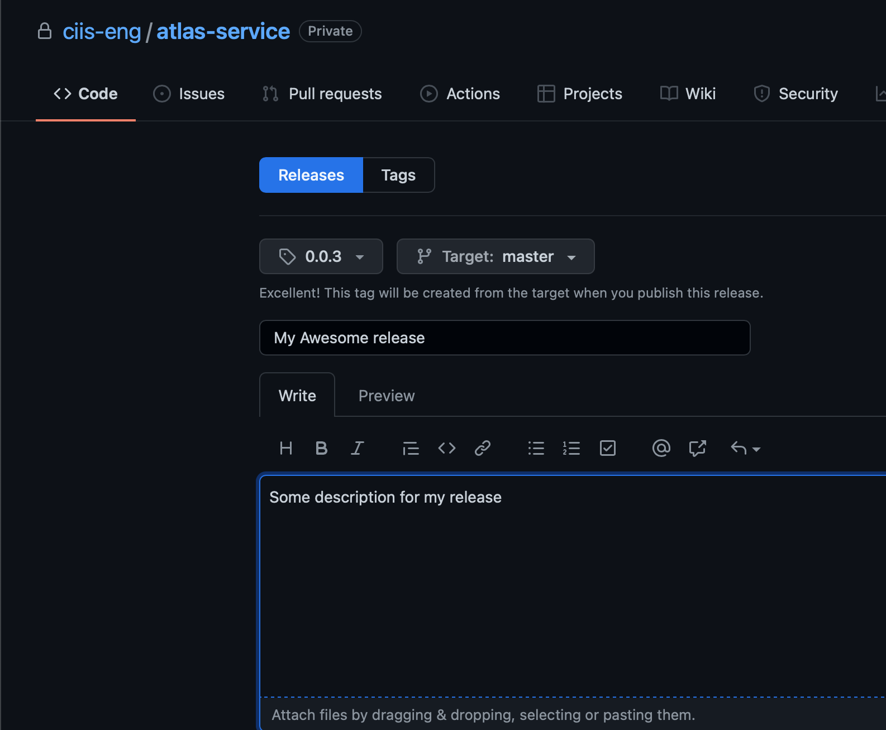
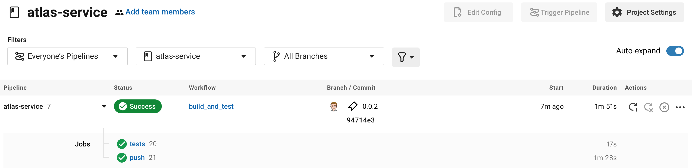
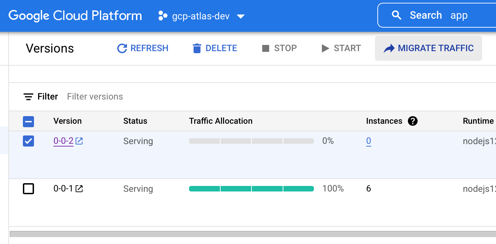

# Kokomo Service

The Kokomo service will provide functionality for OpenMic, notifications and more. The spec describing the exact use of the service can be found here: https://cusa.atlassian.net/wiki/spaces/A/pages/1749222625/Kokomo+Service

# Installing and starting Kokomo Service

## Prerequisites

- NodeJS 16.x LTS

## Installing dependencies

To install dependencies, run `npm i` in the kokomo-service root directory

## Running application

To run the application, run the command `npm start:local` , This will start the application on port 3000

## Running integration tests

To run integration test, first start the application with the command `npm start:itest` , in another command prompt, run the command `npm run test:int`

# Building and deploying the Kokomo Service

To build the Kokomo Service, tag the `master` branch with a tag in the form x.x.x , this will trigger CircleCi to build the Kokomo service, run integration tests, and if those pass, push the service to GCP.

## Step 1 - Tag The Build

Draft the build by drafting a new release in Github: https://github.com/ciis-eng/kokomo-service/releases/new , here you can add a title and description

## Step 2 - Monitor CircleCI build

The CircleCI build is automated, you can view the status of the build here: https://app.circleci.com/pipelines/github/ciis-eng/kokomo-service?filter=all . If there are any issues the build step would show an error checkmark.

## Step 3 - Promote release in App Engine

By default, we do not automatically promote the build to the latest version, to promote the build, navigate to the app engine page   here: https://console.cloud.google.com/appengine/versions?serviceId=default&project=gcp-kokomo-dev , check the "version" you would like to promote to and click "Migrate Traffic"

At this point, your app should be deployed and availabe at https://gcp-kokomo-dev.uc.r.appspot.com/api/v1/ping (ping api for example)

To view logs, simply navigate to the following url: https://console.cloud.google.com/logs/query;query=resource.type%3D%22gae_app%22%0Aresource.labels.module_id%3D%22default%22?project=gcp-kokomo-dev
